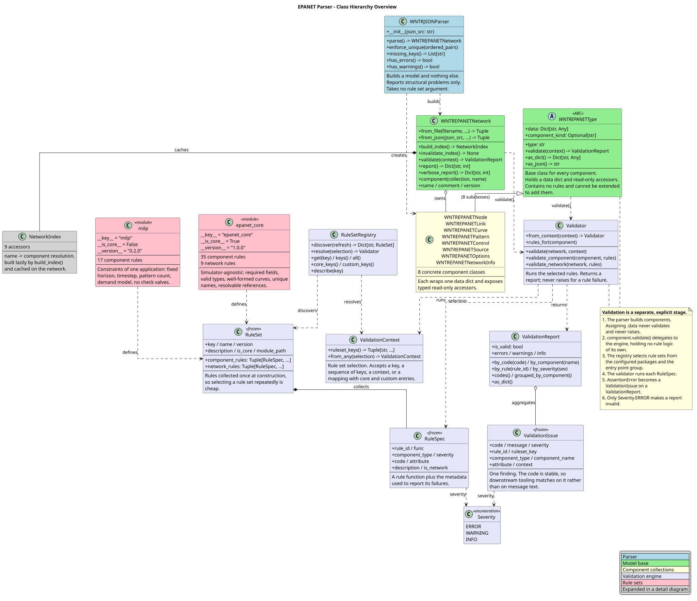
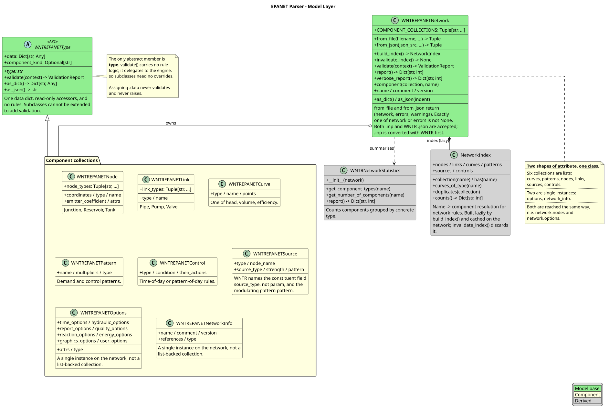
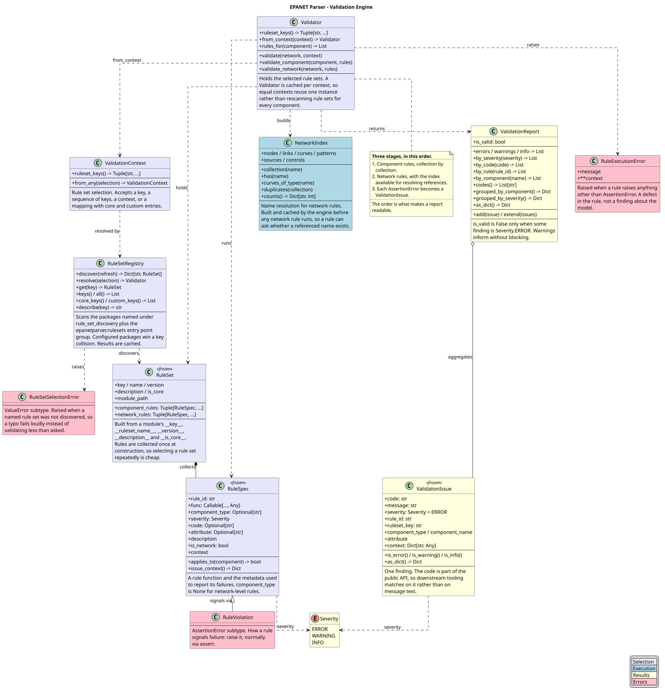
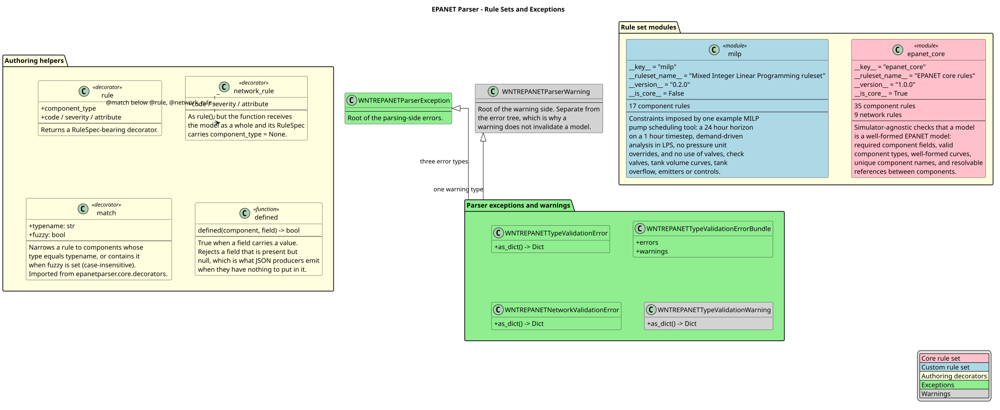

Class Hierarchy
===============

epanetparser is organised as four separate stages:

.. code-block:: text

    EPANET input
        |
        v
    Parser                    builds a model; reports structural problems only
        |
        v
    EPANET model              WNTREPANETType subclasses, no rules
        |
        v
    Static validation         simulator-agnostic; returns a ValidationReport
        |
        v
    Simulator

The four diagrams below follow that pipeline. Each is generated from a
PlantUML source file beside it, so the diagrams and the code can be
checked against each other.

Overview
--------

The whole system in one view. The eight component classes and the
exception hierarchy are collapsed into stub boxes, each labelled with its
real member count; both are expanded in the later diagrams.

The data flow is the part worth reading. The parser builds components and
stops. ``component.validate()`` delegates to the engine, holding no rule
logic of its own, so subclasses need no overrides. The registry selects rule
sets, the validator runs each ``RuleSpec``, and each ``AssertionError``
becomes a ``ValidationIssue`` on a ``ValidationReport``.

Assigning ``.data`` never validates and never raises. That is a guarantee
of the design, not an accident: it is why no component class is subclassed
or patched to add validation.

Model layer
-----------

The eight concrete component classes, the network that owns them, and the
lazy name index. The two shapes of attribute are shown on the network:
six list-backed collections (``curves``, ``patterns``, ``nodes``,
``links``, ``sources``, ``controls``) and two single instances
(``options``, ``network_info``), all reached the same way.

``WNTREPANETType`` has exactly one abstract member, ``type``. The
``validate()`` method on it is a delegation point, not an implementation.

Validation engine
-----------------

Everything in :mod:`epanetparser.core.validation`. A rule failure never
raises: ``validate()`` returns a report. A rule that raises anything other
than ``AssertionError`` is itself defective, and raises
``RuleExecutionError`` instead — a broken rule silently reporting nothing
would let an invalid model pass.

Validation runs in three stages, and the order is what makes a report
readable:

1. component-level rules, collection by collection;
2. network-level rules, with the name index available for resolving
   references;
3. each ``AssertionError`` becomes a ``ValidationIssue``.

Only ``Severity.ERROR`` makes a report invalid.

Rule sets and exceptions
------------------------

The modules that define rules, the decorators used to write them, and the
exception taxonomy.

The core/custom split is the distinction the architecture exists to
express. ``epanet_core`` states what EPANET itself requires, like a
compiler's static checks. A custom set such as ``milp`` states what one
particular formulation can handle. A model can be a valid EPANET model and
still be unusable by a given tool, and both statements are true of the same
object at the same time.

That is also why some rules moved out of the core set. A fixed pattern
length, a fixed horizon and a fixed timestep are application assumptions,
not EPANET ones, so they live in ``custom_rules/milp.py``.

Adding a rule changes nothing else — no registry entry, no import
elsewhere, no base class to subclass. Drop a module into a package listed
under ``rule_set_discovery`` and it is discovered. Severity follows the
function name: ``rule_*`` reports ``ERROR``, ``warn_*`` reports
``WARNING``. Decorator order is ``@rule`` outermost with ``@match`` below
it.

.. note::

   These diagrams describe the codebase as it stands. If the model layer
   changes, they need regenerating along with it.
